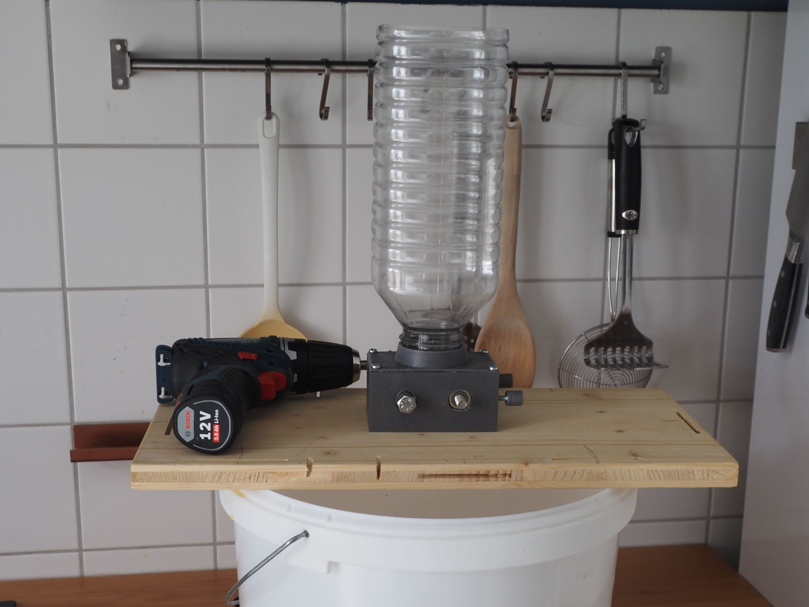

# 3D Printed Malt Mill

This is an open source malt mill design intended mainly for homebrewers with ~20 l batches and ~5 kg grain bills. The mill was designed to only use parts that are  available in many hardware stores to allow easy DIY reproduction and to keep the overall cost low.

For now, this design should still be considered as a work in progress - there is no long term experience for it's durability yet. To get a first impression you can check the photos in the [images](images) folder.

## Main Features

* Geared 40x40 mm rollers with ball bearings
* Adjustable gap (0.25 mm - 2.75 mm gap size)
* Separate hopper attachment part (currently one design for Bericap 48-41 threads)
* Powered by cordless screwdriver

## Bill of materials

Besides food safe PETG or PLA filament you need:

| Pieces | Part                                  | Purpose
| ------ | :------------------------------------ | :---
| 2      | M8 x 80 mm fully threaded hex bolt    | Axles
| 5      | M8 hex nut                            | Roller and gear insert nuts
| 4      | 608 ZZ bearing                        | Roller bearings
| 2      | M4 hex bolt                           | Adjustment screws
| 2      | M4 hex nut                            | Adjustment screw inserts
| 4      | 3x15 mm screws (spax or similiar)     | Hopper attachment
| 4-6    | 3 mm screws (20 mm + board thickness) | Board attachment
| 1      | Bericap 48-41 threaded bottle         | Hopper

Buying recommendations for Germans:  
All metal parts including the bearings should be cheaply available at Hornbach hardware store.
Bericap 48-41 threaded bottles are sold with 2-5 l distilled water in in many stores (i.e. DM, Edeka -- effective 2022).

## Printing considerations

Parts are intended to be printed with 0.25mm layer hight. The model pictured above was printed with PETG.

| Pieces | Part                                  | File
| ------ | :------------------------------------ | :---
| 1      | Main mill frame                       | [frame.stl](stl/frame.stl)
| 2      | Roller                                | [roller.stl](stl/roller.stl)
| 2      | Gear                                  | [gear.stl](stl/gear.stl)
| 2      | Adjustment knob                       | [knob.stl](stl/knob.stl)
| 1      | Spacer                                | [spacer.stl](stl/spacer.stl)
| 1      | Hopper attachment                     | [attachment\_bericap\_4841.stl](stl/attachment_bericap_4841.stl)

It's recommended to print the test parts in [stl/testparts](stl/testparts) first to test fitting of the parts and settings of your 3D printer.

#### Frame
Should be printed upside down. 2 perimeters, 3 top/bottom layers, 12-15% rectilinear infill should be sufficient. No support required.

#### Rollers

Should be printed in direction as rendered. Auto-generated support is required for the bottom nut insert. The lower nut insert is designed a bit deeper than the upper one to counter sagging of the top layers when printing.

Recommended settings are 3 perimeters and 15% rectilinear support. Consider to increase infill, perimeters or to add some solid layers for the first and last 6mm to improve strength of the nut inserts.

#### Gears

Should be printed with flat side down. Auto generated support for nut insert required. 3 perimeters, 3 top/bottom solid layers, 15% rectilinear infill.

## Assembly

All parts are press-fit or screwed together. The mill should be attached to a base board, screwed from the bottom.

## Source Files

Most parts were designed with Open Scad 2021.01. Exception are the gears which were created with FreeCad 0.19.

## License

This project is licensed under GPL v3. 

If you distribute STLs or prints based on this design you are require to provide the (changed) source files along with a copy of the GPL v3 license.